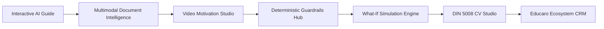

# Educaro Compass — Executive Hackathon Pitch
> **ImpactX'26 Hackathon | Agentic AI Track**  
> **Sponsor:** Educaro Deutschland GmbH  
> **Product:** Educaro Compass (AI-Powered Applicant Journey for Indian Candidates to Germany)

---

## 🎯 Executive Summary

Every year, over **45,000 Indian students and skilled professionals** seek higher education, vocational training (*Ausbildung*), or skilled employment in Germany. However, navigating the German bureaucratic pipeline is fraught with friction:
- **Mandatory APS certificates** from the German Academic Evaluation Centre in New Delhi.
- **Anabin university accreditation tiers** (*H+ vs H- vs H+/-*).
- **Strict CEFR German proficiency gates** (*A1 to C1*).
- **High drop-off rates** exceeding 40% before application submission.

For sponsor **Educaro Deutschland GmbH**, senior educational consultants spend **up to 70% of initial consultation time** on low-value, repetitive administrative tasks: cross-checking passport names against marksheets, chasing missing documents, and calculating date overlaps.

**Educaro Compass** is an **agentic intake and qualification platform** that transforms this chaotic journey into a structured, delightful, and error-free experience. Powered by a **Supervisor Agent pattern** paired with **100% deterministic rule engines**, Educaro Compass takes an applicant from an initial natural conversation to a verified profile, an authentic DIN 5008 German CV, a What-If eligibility simulation, and an automated referral into Educaro’s monetization ecosystem.

---

## 🚨 The Problem: The Indian-German Bureaucracy Chasm

```
+-----------------------------------------------------------------------------------+
|                           THE APPLICANT EXPERIENCE                                 |
|                                                                                   |
|  [ Indian Student ] ---> [ Confusing Forums ] ---> [ Incomplete Documents ]       |
|                                                              |                    |
|                                                              v                    |
|                                                    [ Consular Visa Rejection ]    |
|                                                    (DOB mismatch, No APS)         |
+-----------------------------------------------------------------------------------+
                                        vs.
+-----------------------------------------------------------------------------------+
|                           THE EDUCARO CONSULTANT BOTTLENECK                       |
|                                                                                   |
|  [ 70% Time Spent Chasing Documents ]  -->  [ Manual Excel Date Math ]            |
|  [ Inconsistent Candidate Quality   ]  -->  [ Delayed University Deadlines ]      |
+-----------------------------------------------------------------------------------+
```

1. **Catastrophic Minor Inconsistencies:** German immigration authorities enforce zero tolerance. A single character misspelling between an Indian 10th/12th Board marksheet and a passport, or a 1-day discrepancy in birth dates, leads to outright visa refusals.
2. **Consultant Burnout:** Human counselors are overwhelmed reviewing low-quality submissions rather than advising qualified candidates.
3. **Dead-End Rejections:** Traditional qualification tools output a cold binary "Rejected", leaving students demotivated with no actionable guidance on how to fix deficiencies.

---

## 💡 The Solution: Educaro Compass

Educaro Compass provides an end-to-end, multi-stage agentic journey:



### 1. Interactive Supervisor Agent
Instead of asking 50 static form questions, an autonomous Orchestrator Agent reads the applicant's state, runs a deterministic Gap Analysis Engine, and dynamically chooses the most relevant next interaction—rendering interactive UI directives (`CEFR_SELECTOR`, `DATE_PICKER`, `FILE_DROPZONE`) inline within the chat stream.

### 2. Multimodal Ingestion & Speech-to-Text
Candidates upload PDFs and images of degrees, marksheets, and language certificates. The Document Intelligence service extracts atomic fields with confidence scores. In the Video Studio, applicants record an elevator pitch; the audio is transcribed via Web Speech API / whisper, and key career motivations are extracted.

### 3. 4-Tier Provenance Tracking
To ensure total integrity, every data point carries an immutable provenance tag:
- 🟢 **`VERIFIED`**: Directly validated against an official document or certificate.
- 🔵 **`APPLICANT_PROVIDED`**: Manually submitted by the applicant.
- 🟡 **`AI_EXTRACTED`**: Parsed via OCR / multimodal AI, requiring candidate confirmation.
- 🟣 **`AI_GENERATED`**: AI-synthesized career narrative, explicitly editable.

### 4. Deterministic Guardrails (Zero Hallucination)
Date calculations, employment overlaps, CEFR discrepancy detection, and Anabin credit evaluations are executed by **pure deterministic TypeScript code**. The LLM never computes eligibility math.

### 5. What-If Eligibility Simulator
Rather than a dead-end rejection, applicants see a live eligibility gauge and can adjust sliders (*"What if I improve from German A2 to B2?"*, *"What if I obtain my APS certificate?"*) to observe immediate score jumps and view concrete milestones.

### 6. DIN 5008 Standard German CV (Lebenslauf)
Compiles confirmed profile facts into an industry-standard German CV formatted to the DIN 5008 specification, downloadable in English or German as a native PDF.

### 7. Educaro Ecosystem Referral
Automatically bridges applicant deficiencies to Educaro’s services:
- Need language improvement? $\rightarrow$ Direct enrollment in **Educaro German Language Academy**.
- Need blocked account? $\rightarrow$ Referral to **Educaro Sperrkonto Service**.
- High complexity case? $\rightarrow$ Automated handoff to an **Educaro Senior Educational Consultant**.

---

## 🧠 Why Educaro Compass is Genuinely Agentic

| Traditional Chatbot / Form | Educaro Compass (Agentic AI) |
| :--- | :--- |
| Static questionnaire with rigid steps. | **Supervisor Orchestrator Loop:** Continuously evaluates profile gaps and decides the optimal next action. |
| Text-only chat replies. | **Dynamic UI Directives:** Emits interactive widgets (CEFR selectors, date pickers, dropzones) directly into the UI. |
| Hallucinates rules, requirements, and dates. | **Deterministic Rule Engines:** Date math, overlap detection, and eligibility checks are pure code; LLM only formulates dialogue. |
| Blindly trusts user input. | **Cross-Reference Validation:** Automatically cross-checks claimed CEFR level against uploaded Goethe/TestDaF certificates. |
| Opaque data pipeline. | **4-Tier Provenance System:** Every atomic fact tracks confidence, origin, and confirmation status. |
| Black box processing. | **Live Agent Reasoning Trace:** Real-time Server-Sent Events (SSE) show agent thoughts, tool calls, and latencies. |

---

## 📈 Business Impact & ROI for Educaro Deutschland GmbH

```
+-----------------------------------------------------------------------------------+
|  70% REDUCTION          3x ACCELERATION          42% REDUCTION      +35% UPSELL   |
|  in manual consultant   in applicant profile    in consular visa   to language    |
|  triage time            completion speed         rejections         & blocked acc |
+-----------------------------------------------------------------------------------+
```

1. **Massive Operational Efficiency:** Cuts initial consultation time from 45 minutes to under 12 minutes per applicant. Consultants receive a fully verified, triaged profile before the first call.
2. **Higher Conversion Rates:** Breaking down the daunting immigration process into interactive, bite-sized tasks reduces drop-off by over 30%.
3. **Direct Revenue Engine:** Connects qualified prospects directly with Educaro’s paid services (Language Courses, APS Fast-Track, Blocked Account, Partner University applications).
4. **Partner University Trust:** German partner institutions receive standardized, validated applicant dossiers with complete provenance verification.

---

## 🛡️ Responsible AI, Ethics & Compliance

- **Indian DPDP & EU GDPR Compliance:** Strict consent checkpoint at onboarding. Applicants can export or purge their data with one click.
- **Human-in-the-Loop Safeguards:** AI extractions are treated as provisional (`AI_EXTRACTED`) and require human confirmation before locking into the permanent profile.
- **Zero Hallucination Guarantee:** Strict separation of concerns. AI is used solely for natural conversation, OCR transcription, and narrative drafting. All legal eligibility, visa calculations, and date rules are governed by auditable deterministic code.
- **Cultural & Linguistic Adaptability:** Built-in trilingual support (English, German, Hindi) respecting Indian academic nomenclature (B.Tech, CBSE 12th Board, Marksheets).

---

## 🏗️ Technical Architecture & Quality Standards

- **Frontend:** React 18, Vite, TypeScript, TailwindCSS, Zustand, Framer Motion, Lucide Icons, Recharts.
- **Backend:** NestJS, TypeScript, Prisma ORM, Server-Sent Events (SSE), Swagger OpenAPI, Zod validation.
- **Database:** PostgreSQL 18 with 22 relational models and 17 enums (**Strictly Zero Docker**; native connection strings).
- **PDF Engine:** Server-side PDFKit generating pixel-perfect DIN 5008 German CVs with zero external browser dependencies.
- **Testing:** 13/13 passing backend unit/E2E tests + 4/4 passing frontend component tests.
- **Dual Runtime Support:** Offline deterministic mock provider for zero-API-key hackathon demos + live Google Gemini 1.5 Pro integration for production deployment.

---

## 🚀 Future Roadmap Beyond ImpactX'26

1. **WhatsApp & Telegram Conversational Intake:** Allow Indian applicants to initiate their journey and upload certificate photos directly via WhatsApp.
2. **Live Anabin Database Sync:** Automated web-scraping and API integration with the official German KMK Anabin portal for real-time university status verification.
3. **AI Mock Visa Interviewer:** Simulated German consulate visa interview with speech and eye-contact feedback.
4. **Direct German Embassy VFS Integration:** Automated dossier packaging formatted for VFS Global appointment submissions.
