# Educaro Compass - Database Entity Relationship Diagram (ERD)

This document details the database architecture for **Educaro Compass**, built with PostgreSQL and Prisma ORM.

---

## 1. High-Level Architecture

The data model uses a **hybrid design**:
1. **Normalized Core Tables**: Stable domain entities (`User`, `Applicant`, `ProfilePersonal`, `Education`, `Employment`, `Skill`, `LanguageProficiency`, `Document`, `Motivation`, `Media`).
2. **Provenance-Tracked Fact Layer (`ProfileFact`)**: Every atomic profile attribute is tracked with provenance (`VERIFIED`, `APPLICANT_PROVIDED`, `AI_EXTRACTED`, `AI_GENERATED`), confidence score, evidence link, and revision history.
3. **Deterministic Rules & Tasks**: `QualificationRuleSet` (editable JSON rules), `QualificationResult`, and `ClarificationTask` (inconsistency and missing info issues).
4. **Agent Observability**: `Conversation`, `Message`, `AgentRun`, `AgentStep` (streaming trace), and `AuditLog`.

---

## 2. Mermaid Entity Relationship Diagram

```mermaid
erDiagram
    User ||--o| Applicant : "has profile"
    User ||--o{ ConsultantReferral : "reviews as consultant"
    User ||--o{ AuditLog : "initiates actions"

    Applicant ||--o| ProfilePersonal : "personal details"
    Applicant ||--o{ Education : "education history"
    Applicant ||--o{ Employment : "work history"
    Applicant ||--o{ Skill : "skills & certs"
    Applicant ||--o{ LanguageProficiency : "languages"
    Applicant ||--o{ Document : "uploaded documents"
    Applicant ||--o| Motivation : "goals & motivation"
    Applicant ||--o{ Media : "intro videos"
    Applicant ||--o{ ProfileFact : "provenance audit trail"
    Applicant ||--o{ ClarificationTask : "inconsistencies & gaps"
    Applicant ||--o{ QualificationResult : "eligibility results"
    Applicant ||--o{ Recommendation : "recommended actions"
    Applicant ||--o{ CvDocument : "generated CVs"
    Applicant ||--o{ ConsultantReferral : "consultant handoff"
    Applicant ||--o{ Conversation : "chat conversations"
    Applicant ||--o{ AgentRun : "agent decision traces"

    Document ||--o{ DocumentExtraction : "extracted fields"
    QualificationRuleSet ||--o{ QualificationResult : "evaluated against"
    Conversation ||--o{ Message : "contains"
    AgentRun ||--o{ AgentStep : "recorded steps"

    User {
        uuid id PK
        string email UK
        string passwordHash
        enum role "APPLICANT | CONSULTANT"
        string locale
        boolean isGuest
        datetime createdAt
        datetime updatedAt
    }

    Applicant {
        uuid id PK
        uuid userId FK
        enum goal "STUDY | VOCATIONAL | WORK | UNDECIDED"
        string currentStage
        int completenessScore
        datetime consentGivenAt
        string consentVersion
        datetime createdAt
        datetime updatedAt
    }

    ProfilePersonal {
        uuid id PK
        uuid applicantId FK
        string name
        datetime dob
        string nationality
        string email
        string phone
        string cityIndia
        string targetCityGermany
        datetime availabilityDate
    }

    Education {
        uuid id PK
        uuid applicantId FK
        string institution
        string degree
        string fieldOfStudy
        datetime startDate
        datetime endDate
        string grade
        string gradeScale
        string country
    }

    Employment {
        uuid id PK
        uuid applicantId FK
        string employer
        string role
        text responsibilities
        datetime startDate
        datetime endDate
        boolean isCurrent
        string country
        string industry
    }

    Skill {
        uuid id PK
        uuid applicantId FK
        string name
        enum category "TECHNICAL | PROFESSIONAL | CERTIFICATION"
        string level
        string issuer
        datetime issuedAt
    }

    LanguageProficiency {
        uuid id PK
        uuid applicantId FK
        string language
        string cefrLevel
        enum source "CERTIFICATE | SELF_DECLARED | VIDEO_ASSESSED"
        string certificateName
        datetime testDate
        datetime expiryDate
        string scoreRaw
    }

    Document {
        uuid id PK
        uuid applicantId FK
        enum type "DEGREE | TRANSCRIPT | CERTIFICATE | EXPERIENCE_LETTER | LANGUAGE_CERT | CV | PASSPORT | OTHER"
        string fileName
        string mimeType
        string storageKey
        int pages
        enum processingStatus "QUEUED | OCR | EXTRACTING | NEEDS_REVIEW | DONE | FAILED"
        text ocrText
        float classifiedConfidence
    }

    DocumentExtraction {
        uuid id PK
        uuid documentId FK
        string fieldPath
        jsonb value
        float confidence
        int pageNumber
        jsonb bbox
        enum status "PENDING_REVIEW | CONFIRMED | REJECTED | EDITED"
    }

    Motivation {
        uuid id PK
        uuid applicantId FK
        text reasonForGermany
        string preferredPathway
        text longTermGoals
        string targetField
    }

    Media {
        uuid id PK
        uuid applicantId FK
        enum type "INTRO_VIDEO"
        string storageKey
        float durationSec
        text transcript
        jsonb transcriptSegments
        jsonb extractedInsights
        string status
    }

    ProfileFact {
        uuid id PK
        uuid applicantId FK
        string fieldPath
        jsonb value
        enum provenance "VERIFIED | APPLICANT_PROVIDED | AI_EXTRACTED | AI_GENERATED"
        float confidence
        enum evidenceType "DOCUMENT | VIDEO | CHAT | MANUAL"
        jsonb evidenceRef
        datetime confirmedAt
        string confirmedBy
        int version
    }

    ClarificationTask {
        uuid id PK
        uuid applicantId FK
        enum type "MISSING | INCOMPLETE | INCONSISTENT"
        enum severity "INFO | WARN | BLOCKER"
        jsonb fieldPaths
        text message
        text suggestedAction
        enum status "OPEN | ANSWERED | DISMISSED"
        enum raisedBy "RULE | AGENT"
        jsonb resolution
    }

    QualificationRuleSet {
        uuid id PK
        enum pathway "STUDY | VOCATIONAL | WORK"
        string version
        jsonb rulesJson
        boolean isActive
    }

    QualificationResult {
        uuid id PK
        uuid applicantId FK
        uuid ruleSetId FK
        enum pathway "STUDY | VOCATIONAL | WORK"
        enum status "ELIGIBLE | CONDITIONALLY_ELIGIBLE | NOT_YET_ELIGIBLE | NEEDS_REVIEW"
        int score
        jsonb breakdown
        jsonb missingRequirements
        text explanation
        datetime computedAt
    }

    EducaroService {
        uuid id PK
        string code UK
        string name
        text description
        string pathway
        jsonb prerequisites
        enum ctaType "SERVICE | CONSULTANT | ACTION"
    }

    Recommendation {
        uuid id PK
        uuid applicantId FK
        string serviceCode
        enum type "SERVICE | CONSULTANT_REFERRAL | APPLICANT_ACTION"
        string title
        text reasoning
        int priority
        jsonb nextActions
        string status
    }

    CvDocument {
        uuid id PK
        uuid applicantId FK
        string templateId
        enum language "EN | DE"
        jsonb contentJson
        string pdfStorageKey
        int version
    }

    ConsultantReferral {
        uuid id PK
        uuid applicantId FK
        uuid consultantId FK
        datetime slotRequestedAt
        string status
        text handoffSummary
        text notes
    }

    Conversation {
        uuid id PK
        uuid applicantId FK
        string status
    }

    Message {
        uuid id PK
        uuid conversationId FK
        enum role "USER | AGENT | SYSTEM"
        text content
        jsonb uiHints
        datetime createdAt
    }

    AgentRun {
        uuid id PK
        uuid applicantId FK
        string trigger
        string status
        datetime startedAt
        datetime finishedAt
    }

    AgentStep {
        uuid id PK
        uuid runId FK
        string agentName
        enum kind "THOUGHT_SUMMARY | TOOL_CALL | TOOL_RESULT | DECISION | ERROR"
        string toolName
        jsonb input
        jsonb output
        int latencyMs
        jsonb tokenUsage
    }

    AuditLog {
        uuid id PK
        string actorId
        string action
        string entity
        string entityId
        jsonb diff
        datetime createdAt
    }
```

---

## 3. Data Governance & Provenance Rules

- **Zero Invention**: A fact cannot be marked `VERIFIED` without an official document or consultant sign-off.
- **Traceability**: Every entry in `ProfileFact` has a `evidenceRef` pointing to a document ID + page number, an audio timestamp in `Media`, or a `Message` id.
- **Human-in-the-Loop**: Extractions created by the Document Intelligence Agent start as `PENDING_REVIEW` with `AI_EXTRACTED` status until explicitly confirmed by the user or consultant.
- **Deterministic Precedence**: Clarifications are created deterministically whenever conflicting facts exist across sources.
